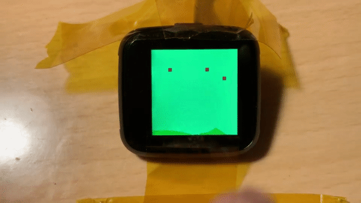

# mbed-pinetime



## Getting Started

Install dependencies:

- python3
- c/c++ compiler, prefereable the GNU GCC compiler version 9

Optionally, install `nrfjprog`

- MAC:

    ```bash
    brew cask install nordic-nrf-command-line-tools
    ```

- Linux

    TODO

## Getting the source code

```bash
mbed import git@github.com:geoffrey-vl/mbed-pinetime.git
```

You can off course also clone the repo manually using git, and next issue `mbed deploy`
to pull the submodules.

The mbed toolchain requires Python and some additional python packes which don't come
with the default Python installation. To install the additional packages:

Install all the Python packages required for Mbed. Your options are:

- Install from the Pipfile. `pipenv install`
- Install from Mbed requirements.txt `pip install -r mbed-os/requirements.txt`

## Compiling

```bash
mbed compile -t GCC_ARM
```

Note that the .mbed file has the mbed target fixed.
A more complete command:

```bash
mbed compile -m PINETIME_DEV_KIT -t GCC_ARM
```

If you want to target the NRF52-DK board which is very similar to the PineTime use:

```bash
mbed compile -m NRF52_DK -t GCC_ARM
```

## Development Notes

- [x] BMA421 Accelerometer
- [-] HRS3300 Heart Rate Sensor
- [x] Hynitron CST816S Touch Pad
- [-] Sitronix ST7789V LCD Driver
- [x] Macronix SPI Flash
- [x] Vibrator
- [x] LED backlight
- [x] ADC Battery Voltage Sense
- [ ] Physical button

### I2C

00> 0x15 Touchpad

- Only responds after a touch event.
- At 100khz, Limit of read from register 0x00 after a touch event is 190-195ish bytes. This is probably due to the chip going back to sleep.

00> 0x18 ACK Accelerometer

- BMA421 -- Not a public avalible chip, therefore no publicly availible drivers.
- Similar to BMA423
- Seems to require binary blob on startup (chip firmware?)

00> 0x44 ACK HALS3300 Heart Rate Sensor

- Datasheet is OK
- Resolution was set to 16bits 0x08
- Gain was set to 1 0x02

### SPI

Flash:

- SPI flash is now working with Mbed SPIF driver
- Needed to be "reset" by letting the battery die
- 4194304 bytes

Display:

- Display needs mode 3 SPI?
- https://www.allaboutcircuits.com/technical-articles/spi-serial-peripheral-interface/
- Got it sort-of working with Mbed ports of the Adafruit GFX libraries.
- Still work to be done here

I can't get the physical button to work for the life of me. Someone please help 😂
