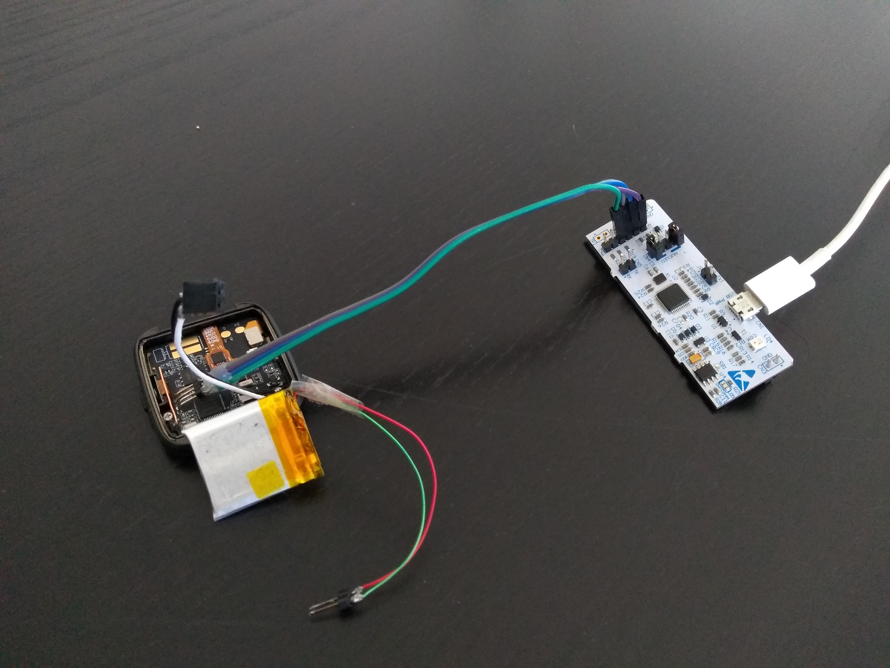

# mbed-pinetime

 

## Getting Started

Install dependencies:

- python3
- c/c++ compiler, preferable the GNU GCC compiler version 9

## Getting the source code

```bash
mbed import git@github.com:geoffrey-vl/mbed-pinetime.git
```

You can off course also clone the repo manually using git, and next issue `mbed deploy`
to pull the submodules.

The mbed toolchain requires Python and some additional python packages which don't come
with the default Python installation. To install the additional packages:

Install all the Python packages required for Mbed. Your options are:

- Install from the Pipfile. `pipenv install`
- Install from Mbed requirements.txt `pip install -r mbed-os/requirements.txt`

## Compiling

```bash
mbed compile -t GCC_ARM
```

Note that the .mbed file has the mbed target fixed.
A more complete command:

```bash
mbed compile -m PINETIME_DEV_KIT -t GCC_ARM
```

If you want to target the NRF52-DK board which is very similar to the PineTime use:

```bash
mbed compile -m NRF52_DK -t GCC_ARM
```

## Development Notes

- [ ] BMA421 Accelerometer
- [ ] HRS3300 Heart Rate Sensor
- [x] Hynitron CST816S Touch Pad
- [x] Sitronix ST7789V LCD Driver
- [ ] Macronix SPI Flash
- [ ] Vibrator
- [x] LED backlight
- [x] ADC Battery Voltage Sense
- [x] Physical button
- [ ] BLE
- [x] Segger RTT

## Flashing

### Remove Flash protection

For non-jlink program/debug probes you must first remove the Flash protection.
Here is a good guide: [Advanced Topic: Remove nRF52 Flash Protection With Raspberry Pi](https://medium.com/@ly.lee/coding-nrf52-with-rust-and-apache-mynewt-on-visual-studio-code-9521bcba6004).

### Flashing using OpenOcd and ST-LINK

Here is a good guide on how to flash your Pinetime using an ST-Link probe:
[Flashing your PineTime using an ST-Link and OpenOCD](https://dev.to/aaronc81/flashing-your-pinetime-using-an-st-link-and-openocd-54dd).

Wiring:



With your self-compiled version of OpenOCD:

```bash
./src/openocd -s tcl -f nrf52.cfg -d3
```

In a second terminal, start a telnet session to your OpenOCD server:

```bash
telnet localhost 4444
```

In that telnet session you can use following commands:

- stop execution:

    ```bash
    reset halt
    ```

- flash:

    ```bash
    program path_to_your_workspace/mbed-pinetime/BUILD/PINETIME_DEV_KIT/GCC_ARM-DEBUG/mbed-pinetime.hex verify reset
    ```

### Flashing using Black Magic Probe

Wiring:


```bash
$ dmesg
...
[15890.983223] usb 3-2: new full-speed USB device number 5 using xhci_hcd
[15891.159637] usb 3-2: New USB device found, idVendor=1d50, idProduct=6018, bcdDevice= 1.00
[15891.159645] usb 3-2: New USB device strings: Mfr=1, Product=2, SerialNumber=3
[15891.159649] usb 3-2: Product: Black Magic Probe
[15891.159652] usb 3-2: Manufacturer: Black Sphere Technologies
[15891.159655] usb 3-2: SerialNumber: 79AB599E
[15891.179746] cdc_acm 3-2:1.0: ttyACM3: USB ACM device
[15891.185771] cdc_acm 3-2:1.2: ttyACM4: USB ACM device

$ arm-none-eabi-gdb
GNU gdb (GNU Tools for Arm Embedded Processors 9-2019-q4-major) 8.3.0.20190709-git
Copyright (C) 2019 Free Software Foundation, Inc.
License GPLv3+: GNU GPL version 3 or later <http://gnu.org/licenses/gpl.html>
This is free software: you are free to change and redistribute it.
There is NO WARRANTY, to the extent permitted by law.
Type "show copying" and "show warranty" for details.
This GDB was configured as "--host=x86_64-linux-gnu --target=arm-none-eabi".
Type "show configuration" for configuration details.
For bug reporting instructions, please see:
<http://www.gnu.org/software/gdb/bugs/>.
Find the GDB manual and other documentation resources online at:
    <http://www.gnu.org/software/gdb/documentation/>.

For help, type "help".
Type "apropos word" to search for commands related to "word".
(gdb) target extended-remote /dev/ttyACM3
Remote debugging using /dev/ttyACM3
(gdb) mon tpwr enable
(gdb) monitor swdp_scan
Target voltage: 3.3V
SW-DP scan failed!
```
